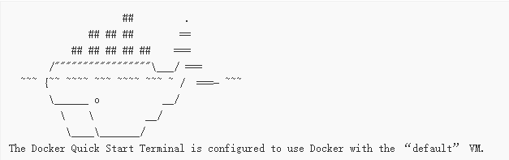

---
title: docker实践 mpb上跑oracle
date: 2017-05-27 21:19:21
tags:

---

学校准备oracle考试

自己带电脑

想想上个月才换的二手mbp瞬间尴尬

官方文档上面的MAC oracle真的没有兴趣坑 而且好像版本才到10g

然后想想最近在研究docker，用科学的上网方式一看，果然可以

然后在github上看到了一个项目 [docker-oracle-xe-11g](https://github.com/wnameless/docker-oracle-xe-11g)觉得可以搞一搞

## 折腾过程

### 首先安装Docker Toolbox（傻瓜式的集成环境，Windows也有同款）

#### 首先简述一下运行原理
>因为Docker Engine daemon 使用Linux内核守护进程，所以你不能原生的在Mac上使用Docker Engine,必须要使用 Docker Machinecommand在你本机创建和连接一个Linux虚拟机，给你本机使用的一个虚拟主机Docker引擎。
>（Window同理）

1. 安装过程

	
	
	
	
	

	最后出来这个装满集装箱的鲸鱼就好了。。。。。

	

2. 测试一下

	 `docker version`

	

### 安装   docker-oracle-xe-11g

#### 因为只是运行，所以没有什么配置演示都是默认配置

* 首先默认的虚拟docker引擎都是ubuntu的

	在16.04上`docker pull wnameless/oracle-xe-11g`

	在14.04.4上`docker pull wnameless/oracle-xe-11g:14.04.4`

* 然后开放22和1521接口

	 `docker run -d -p 49160:22 -p 49161:1521 wnameless/oracle-xe-11g`
* 接着开启远程服务

	`docker run -d -p 49160:22 -p 49161:1521 -e ORACLE_ALLOW_REMOTE=true wnameless/oracle-xe-11g`

* 数据库默认设置

		hostname: localhost
		port: 49161
		sid: xe
		username: system
		password: oracle
* SYS和SYSTEM的密码

		oracle

* SSH连接docker服务器

		ssh root@localhost -p 49160
		password: admin
* 支持自定义数据初始化

		# Dockerfile
		FROM wnameless/oracle-xe-11g

		ADD init.sql /docker-entrypoint-initdb.d/
